**Lab Report 1**
1. Installing VScode
I had visual studio code installed from CSE 11, so this part of lab 1 was already setup on my computer. I had to open a new terminal on VS code to get started. 
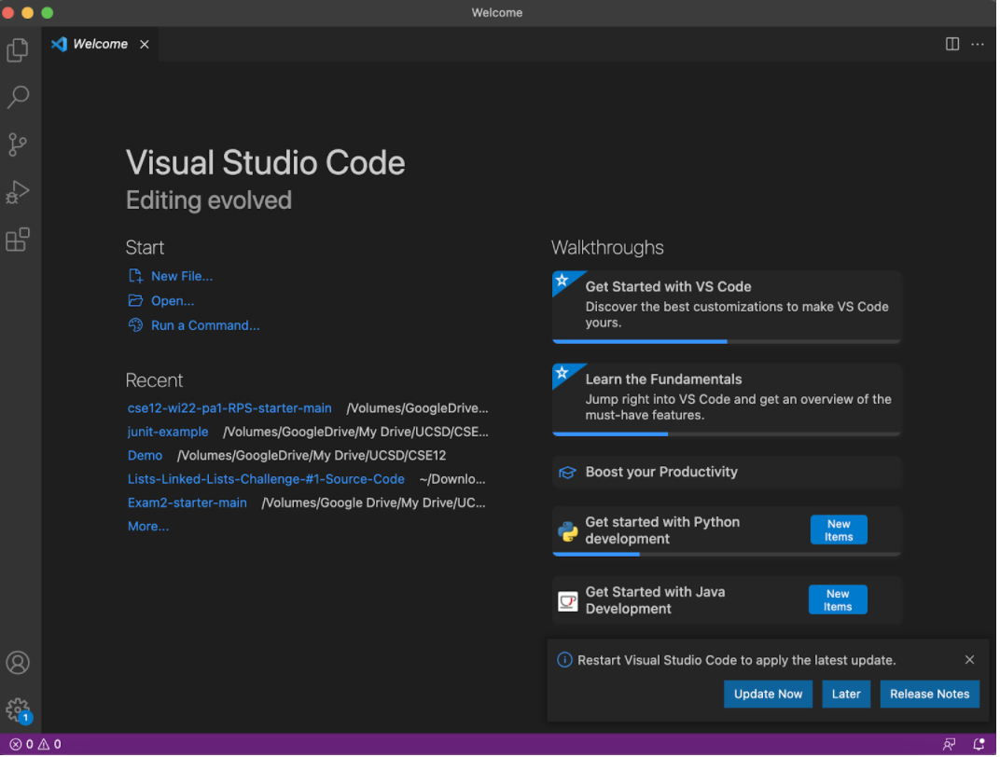

2. Remotely Connecting
In VS code, I connected to the remote computer. First, I opened a new terminal on VS code. I used the ssh command to connect to the remote computer by using ssh and my course specific account (ssh cs15lwi22ana@ieng6.ucsd.edu). Then, I was asked if I wanted to continue to connect and I said yes. After saying yes, I was able to connect to the server and this resulted in a box called cluster system showing up to demonstrate that the client is accessing the server. 
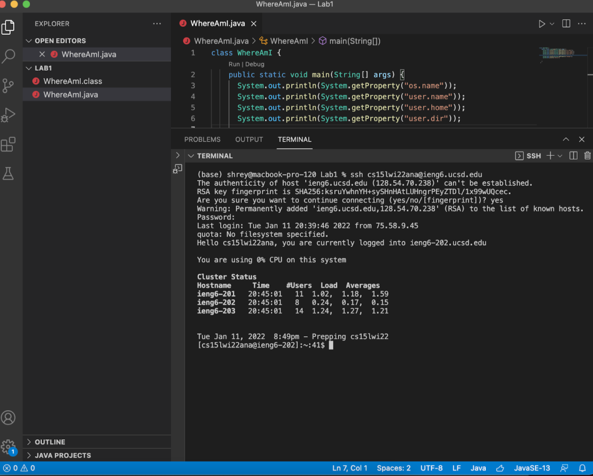

3. Trying Some Commands
Next, I tried a few commands. I tried ls to list the files in my current directory, which showed that I had WhereAmI.java, the class WhereAmI.class, and perl5 on the remote server. Next, I tried pwd, which brought up the current working directory. The pwd command showed Linux proving that I had actually connected to the remote server. Finally, I did cat, which shows the content of the file that you write after the command. I typed the command cat WhereAmI.java to print its contents and got the output shown below. 
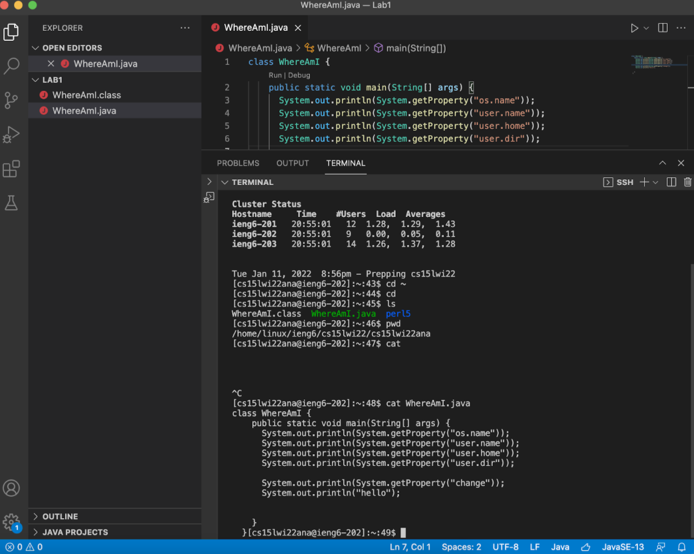

4. Moving Files with scp
To form the secure shell connection, I first logged out of the remote server by typing exit. Then, I compiled and ran the two files in my current directory, WhereAmI.java and WhereAmI2.java (both files’ contents are listed at the bottom of the instructions). After using javac and java, I used the scp command to make a copy of these files to the remote server (ex: scp WhereAmI2.java cs15lwi22ana@ieng6.ucsd.edu:~/). Then, I typed ls to see the files in the remote server giving me both of the files I had copied over. I then did javac and java on the remote server to compile and run them there. 
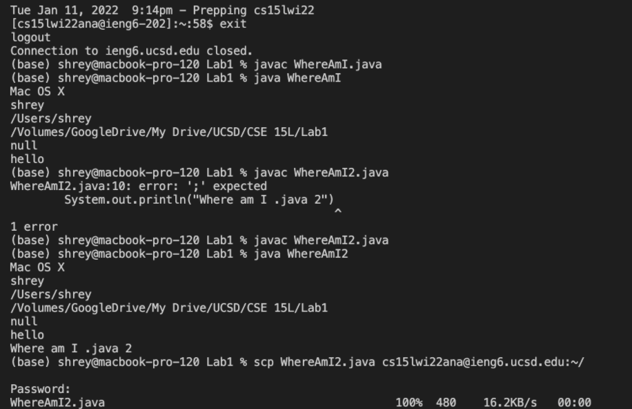
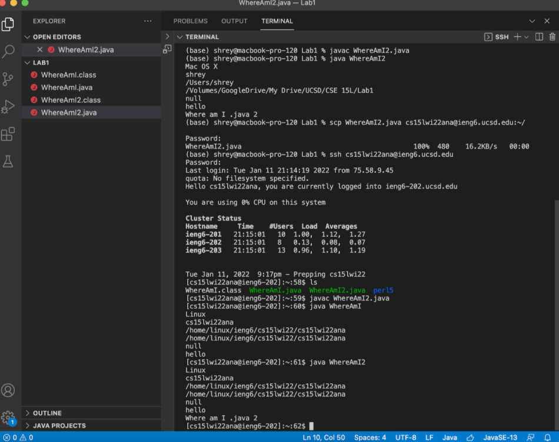

5. Setting an SSH Key
First, I exited the server. Then, I typed ssh-keygen to generate the pairs of authentication keys. After, I re-connected to the remote server using ssh. I made a directory on the remote server called .ssh to save the public key to. I ran into a few errors in this process because I already had an ssh directory on the server and on my computer because I did this process before, so there is a screenshot of me troubleshooting using commands from before here to rename the directory. Then I used another scp command (scp /Users/shrey/.ssh/id_rsa.pub cs15lwi22ana@ieng6.ucsd.edu:~/.ssh/authorized_keys) to finish the key setup process. After this step, I was able to ssh and scp without using my password and just with the passphrase. 
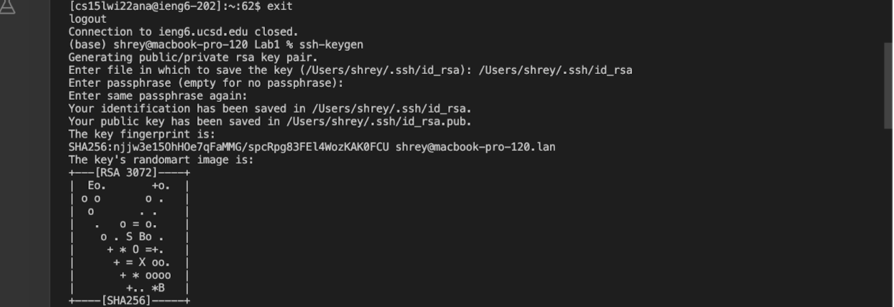
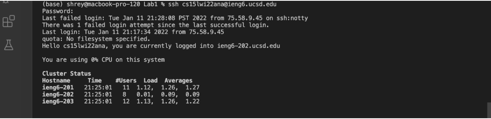

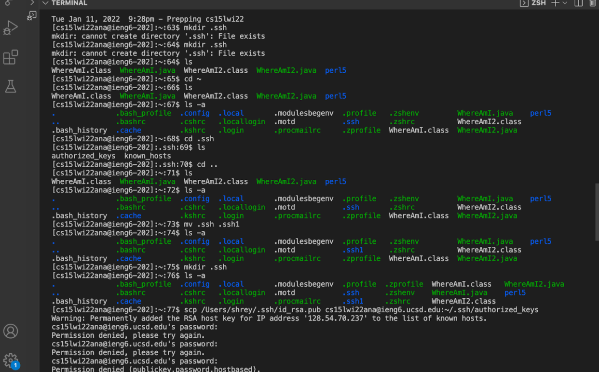

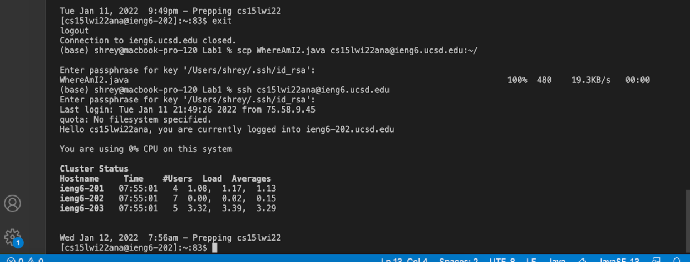

6. Optimizing Remote Running
Here, I tried out some shortcuts to make edits to files and run them on the remote server. I tried doing ssh and cat on the same line using quotes around cat. I also tried running the javac and java command on the same line separated by a semicolon. I made edits to the WhereAmI.java file and found that running the javac and java commands at once made the process of editing files on the client and running files on the server faster. 
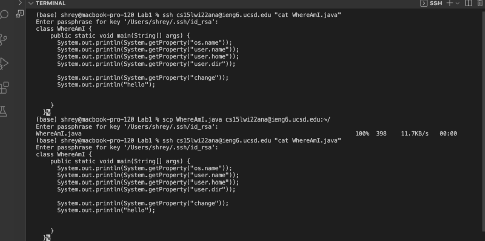
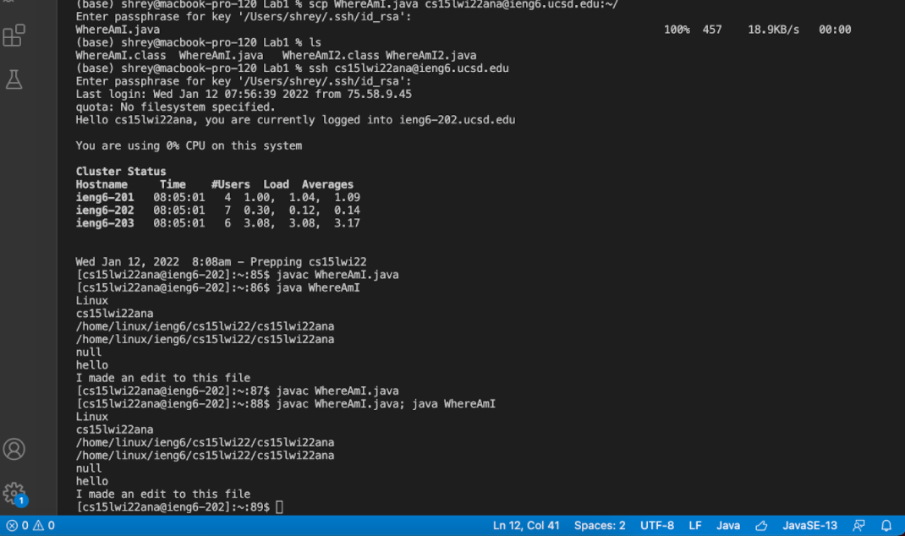

7. Reference to the 2 files I compiled and ran on the server
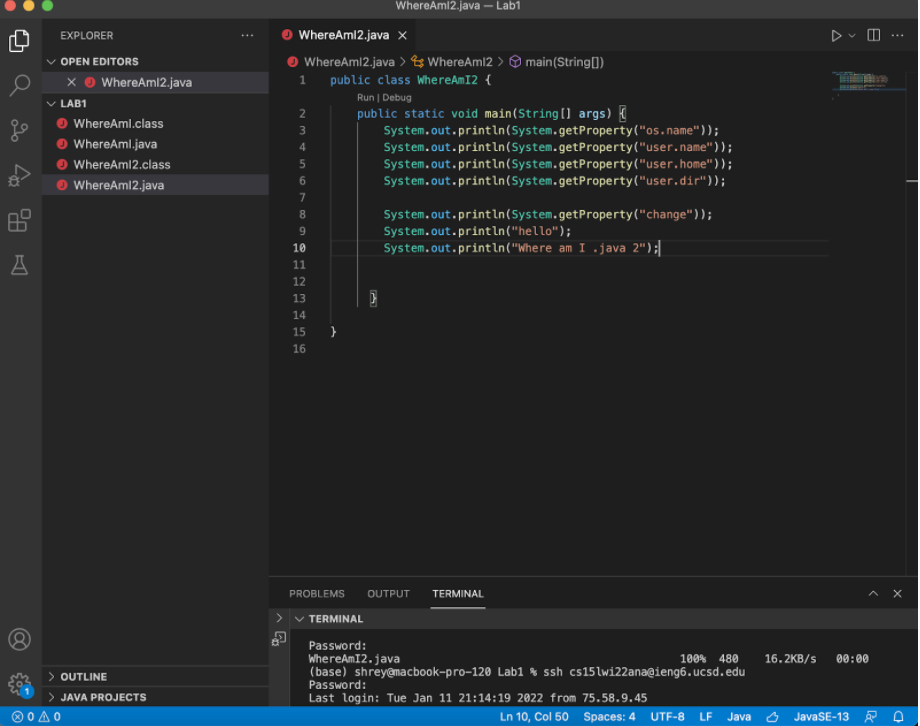
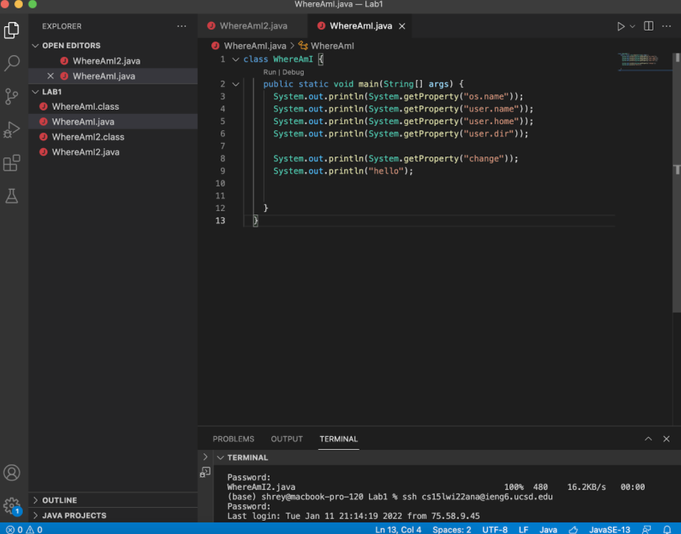
