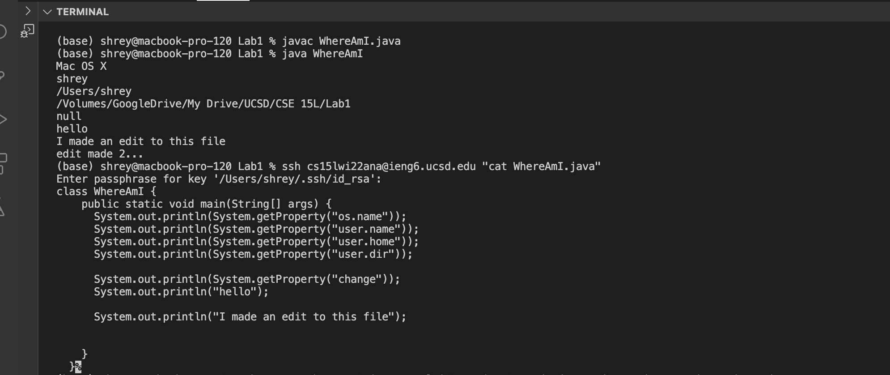
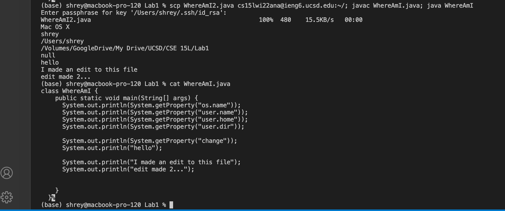

# Lab Report 1
---
1. ### Installing VSCode

In order to install Visual Studio code, I went to the link attached below titled VSCode download link to download the MAC version, however, you can download the version you need based on your operating system and all the OS download options are listed on the website link.  

[VSCode download link for different OS](https://code.visualstudio.com/)

After VSCode installed on my computer, I opened a new window and terminal using the new window option under file and new terminal option under terminal. 

2.  ### Remotely Connecting

In VSCode, I connected to the remote computer. First, I opened a new terminal on VS code. I used the ssh command to connect to the remote computer by using ssh and my course specific account `ssh cs15lwi22ana@ieng6.ucsd.edu`. Then, I was asked if I wanted to continue to connect and I said yes. After saying yes, I was able to connect to the server and this resulted in a box called cluster system showing up to demonstrate that the client is accessing the server. 

3. ### Trying Some Commands

Next, I tried a few commands. I tried ls to list the files in my current directory, which showed that I had `WhereAmI.java`, the class `WhereAmI.class`, and `perl5` on the remote server. Next, I tried `pwd`, which brought up the current working directory. The pwd command showed Linux proving that I had actually connected to the remote server. Finally, I did `cat`, which shows the content of the file that you write after the command. I typed the command `cat WhereAmI.java` to print its contents and got the output shown below. 

4. ### Moving Files with scp

To form the secure shell connection, I first logged out of the remote server by typing `exit`. Then, I compiled and ran the two files in my current directory, `WhereAmI.java` and `WhereAmI2.java` (both files’ contents are listed at the bottom of the instructions). After using `javac` and `java`, I used the `scp` command to make a copy of these files to the remote server (ex: `scp WhereAmI2.java cs15lwi22ana@ieng6.ucsd.edu:~/`). Then, I typed `ls` to see the files in the remote server giving me both of the files I had copied over. I then did `javac`and `java` on the remote server to compile and run them there. 

#### Photo 1: Trying to scp WhereAmI2.java

#### Photo 2: Trying to scp WhereAmI.java

5. ### Setting an SSH Key

First, I exited the server. Then, I typed `ssh-keygen` to generate the pairs of authentication keys. After, I re-connected to the remote server using `ssh`. I made a directory on the remote server called .ssh to save the public key to. I ran into a few errors in this process because I already had an ssh directory on the server and on my computer because I did this process before, so there is a screenshot of me troubleshooting using commands from before here to rename the directory. Then I used another scp command (`scp /Users/shrey/.ssh/id_rsa.pub cs15lwi22ana@ieng6.ucsd.edu:~/.ssh/authorized_keys`) to finish the key setup process. After this step, I was able to `ssh` and `scp` without using my password and just with the passphrase. 

#### Troubleshooting when making directory:

6. ### Optimizing Remote Running

To make edits to files and run them on the remote server, I did `ssh` and `cat` on the same line using quotes around `cat`. I also tried running the `javac` and `java` command on the same line separated by a semicolon. I made edits to the WhereAmI.java file and ran the `javac` and `java` commands in one line. This allowed me to use only 7 keystrokes,  2 keystrokes for the initial `javac` and `java` commands on my computer, 2 keystrokes for the `ssh`, `cat`, and passphrase, 2 keystrokes for `scp`, `javac`, and `java` on the server and 1 for the final `cat` to see if the edit worked. 

7. ### Reference to the 2 files I compiled and ran on the server

