# Lab Report 1
---
## 1. Code Change Diff One For Test File 3 - File with Image

[Link to Test File With Failure Inducing Input: TestFile3.md](https://github.com/ShreyaVelagala/markdown-parse/blob/main/TestFile3.md)

### Code change Github:
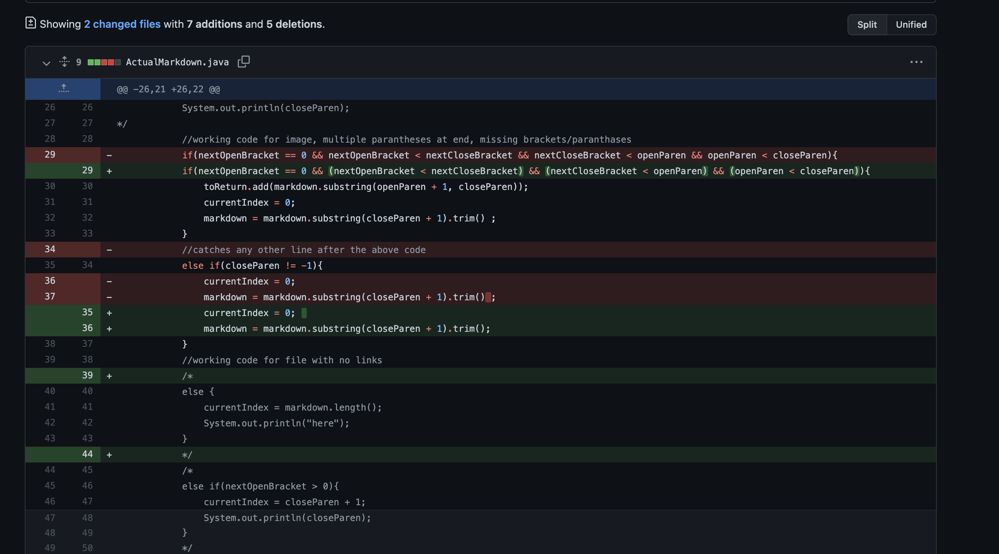
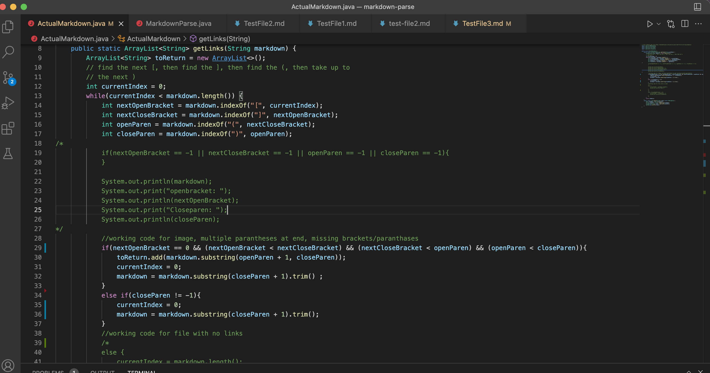


### Symptom for Failure-inducing input:
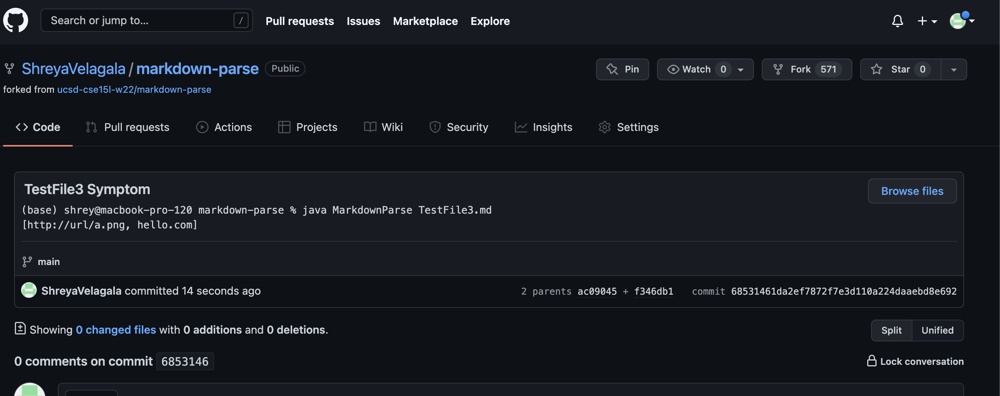

The failure-inducing input was a file with an image. For this file, the image url should not print, however, it did because the bug in the original code was that the code used the index of the first bracket, proceeding bracket and parentheses to identify the URL as a substring.
Because of the symptom that the image URL printed, a solution had to be made using conditional statements to differentiate links and images and produce the correct output where only the link in the test file is printed. 

---

## 2. Code Change Diff One For Test File 1 - File With No Links

[Link to Test File With Failure Inducing Input: TestFile1.md](https://github.com/ShreyaVelagala/markdown-parse/blob/main/TestFile1.md)

### Code change Github:
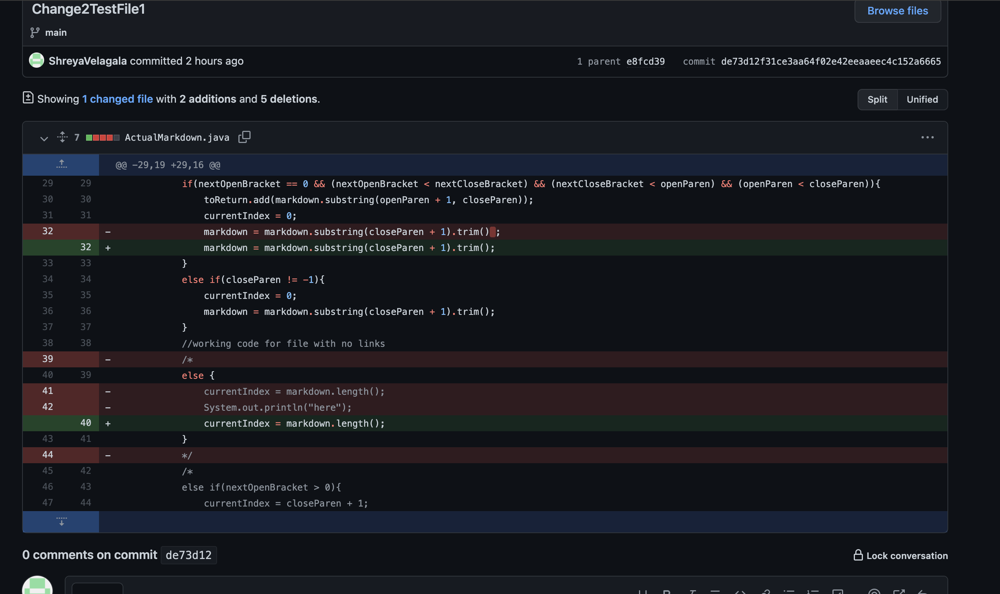
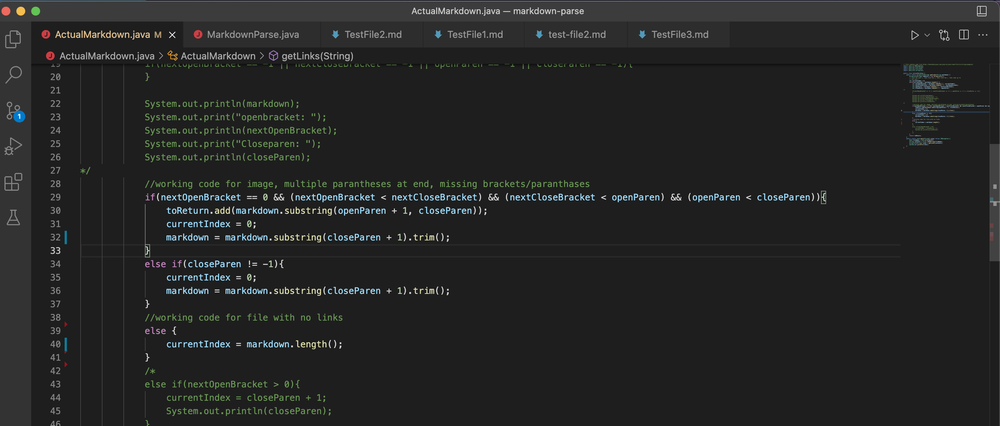


### Symptom for Failure-inducing input:
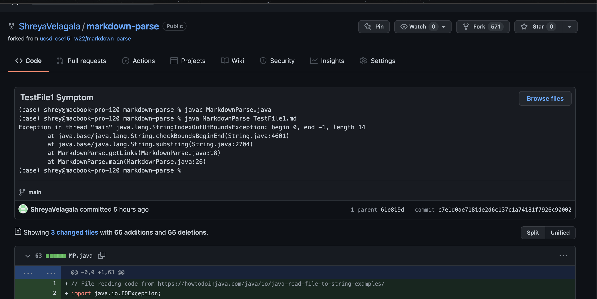

The failure-inducing input was a file with no links. The symptom here is that a string index out of bounds error occurred when actually an empty arraylist should be returned because no links were found in the file. The bug in this case was that the ```.indexOf()``` method assigned -1 to all the indicies of the brackets and parenthesis since they were missing so an else statement had to be used to catch instances when empty files were passed in. 
---

## 3. Code Change Diff One For Test File 2 - File with Multiple Parentheses

[Link to Test File With Failure Inducing Input: TestFile2.md](https://github.com/ShreyaVelagala/markdown-parse/blob/main/TestFile2.md)


### Code change Github:
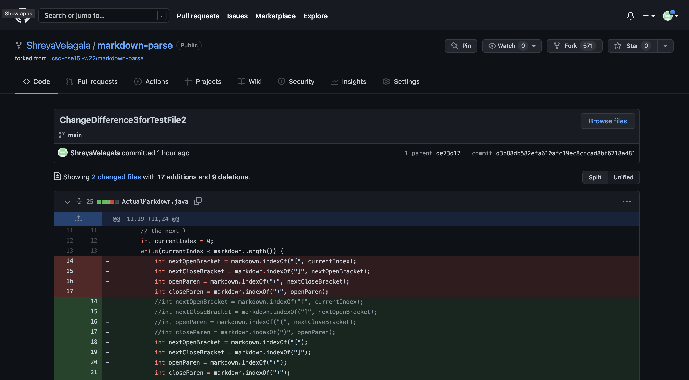
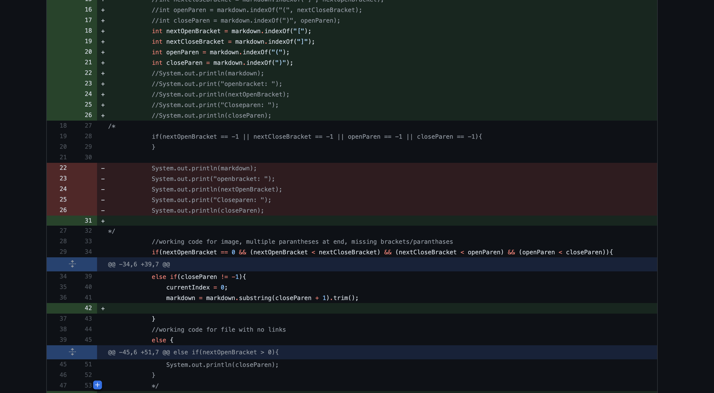
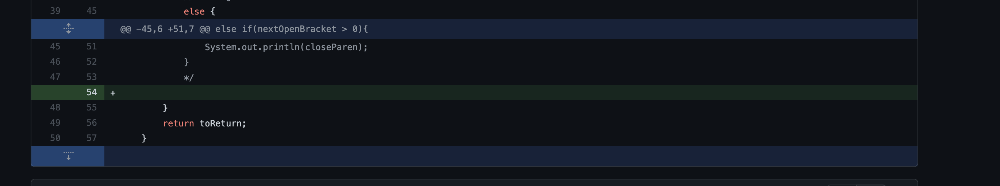
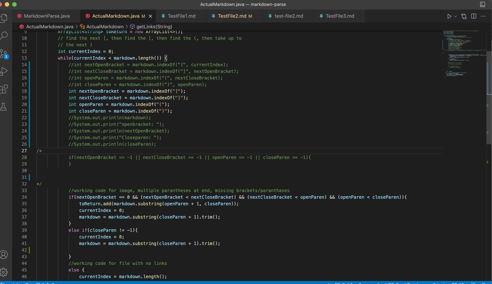

### Symptom for Failure-inducing input:
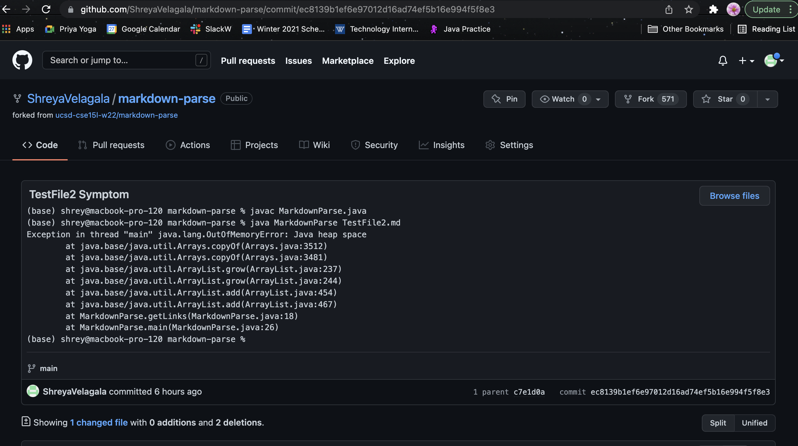

The failure-inducing input was a test file with multiple paranthases. This caused an out of memory error and another symptom where links under the link with multiple paranthases after it would not print. The bug in this case related to the memory error because the while loop became infinite as the current index always stayed less than the markdown length, so a conditional statement was needed to catch this instance and continue to other links & text afterwards.
