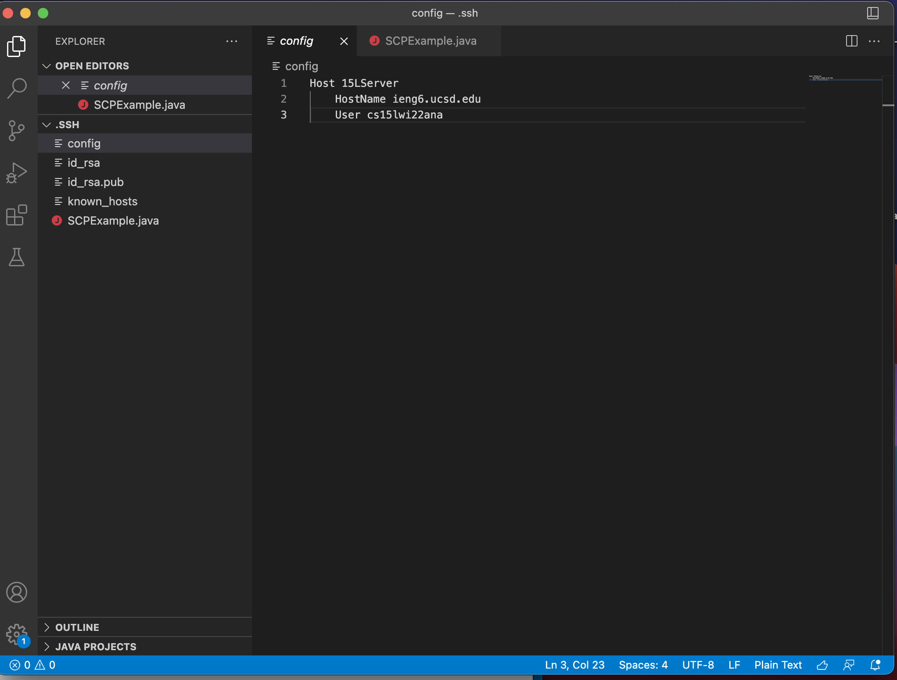
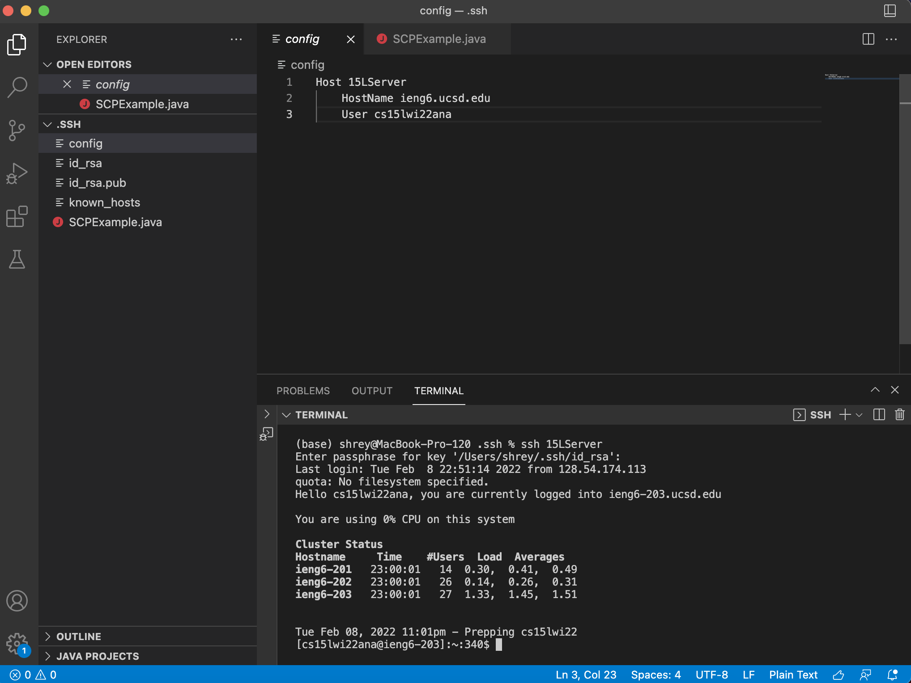
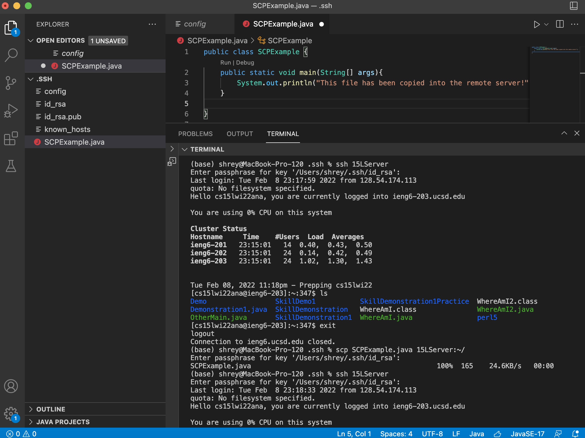
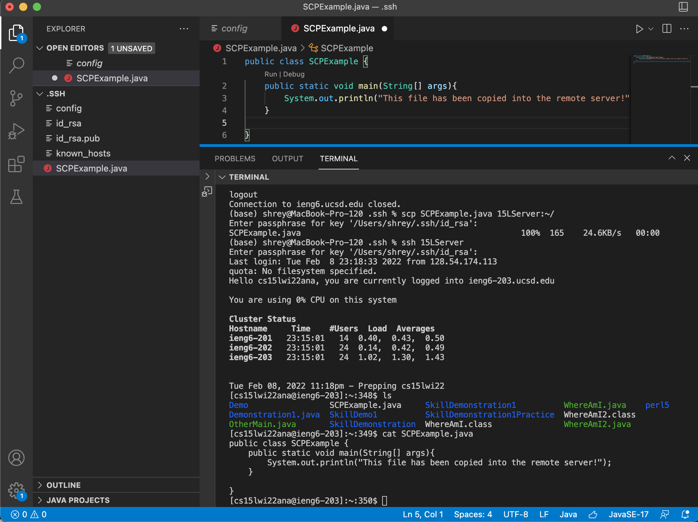

# Lab Report 3
---

## Streamlining ssh Configuration 
---

### 1. Editing `.ssh/config` file 

#### `.ssh/config` file and `.ssh` hidden folder open on VScode: 

In this screenshot, the .ssh hidden folder is open. I opened this folder by navigating to the hidden files on my computer using `command + shift + period`. Once I opened this folder on VScode, I created the config file using the new file button and adding in the following content with 15LServer as the alias name for my server. 

---

### 2. `ssh` command using alias to log into remote server

#### Terminal command using alias and `ssh` on VScode terminal:

In this screenshot, I used the command `ssh 15LServer`, which uses the alias name I created for ssh to interpret, `15LServer`. Using this command, I was able to quickly log into the remote server as shown by the cluster status table that shows up in the screenshot. 

---

### 3. `scp` command with alias to copy file to remote server

#### Terminal `scp` command using alias on VScode terminal:

#### Replacing `scp SCPExample.java cs15lwi22ana@ieng6.ucsd.edu:~/` with `scp SCPExample.java 15LServer:~/`

In this screenshot, I used the `scp SCPExample.java 15LServer:~/` command to copy my SCPExample.java file into the remote server. By using the `15LServer` alias in place of `cs15lwi22ana@ieng6.ucsd.edu`, I was able to shorten the process of copying files over to the remote server. I also used `ls` and `cat` to show that the file copied over and that the contents of the file printed.  

