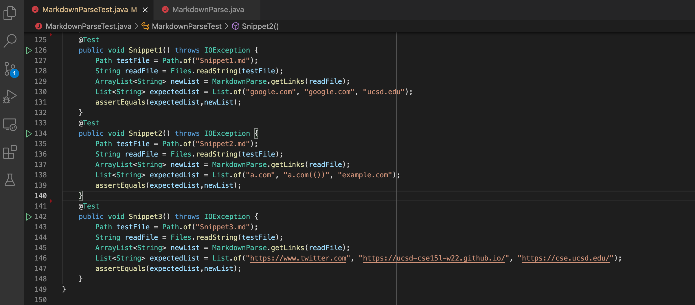

# Lab Report 3
---
### Links to Repositories: 
>[Link to my MarkdownParse Repository](https://github.com/ShreyaVelagala/markdown-parse)


>[Link to my MarkdownParse Repository of Group Reviewed](https://github.com/vs2961/markdown-parse)
---
### Expected Code Output to be Produced by Each Snippet
#### 1. Snippet 1
##### ```[google.com, google.com, ucsd.edu]```
#### 2. Snippet 2
##### ```[a.com, a.com(()), example.com]```
#### 2. Snippet 3
##### ```[https://www.twitter.com, https://ucsd-cse15l-w22.github.io/, https://cse.ucsd.edu/]```


---
###  Code for Tests from ```MarkdownParse.java```:


---
### Output When Running Tests for My Implementation 


The tests for Snippet1, Snippet 2, and Snippet 3 fail as shown by the text ```There were 3 failures:```, ```1) Snippet1(MarkdownParseTest)```, ```2) Snippet2(MarkdownParseTest)```, and ```3) Snippet3(MarkdownParseTest)``` in the terminal.  

---

### Output When Running Test for Implementation Reviews


The tests for Snippet1 and Snippet2 fail as shown by the text ```There were 2 failures:```, ```1) Snippet1(MarkdownParseTest)```, and ```2) Snippet2(MarkdownParseTest)``` in the terminal. 

However, Snippet3 passes because it is not mentioned as a test case failure in the terminal. I also printed toReturn using ```System.out.println(toReturn); ``` before returning toReturn to see if the output for Snippet3's test actually matches the expected output and it does. I commented out all the other tests and only printed toReturn for Snippet3. It has the expected output by printing ```[https://www.twitter.com, https://ucsd-cse15l-w22.github.io/, https://cse.ucsd.edu/]```.

#### Image for Printing ```toReturn1```:


#### Image for Output of Code Snippet3:


#### Answering Questions:
##### 1. 