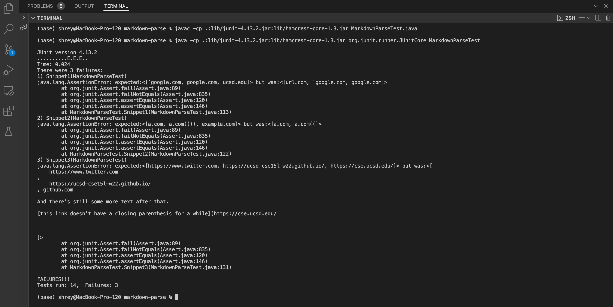

# Lab Report 4
---
### Link to my MarkdownParse Repository: 
>[Link to my MarkdownParse Repository](https://github.com/ShreyaVelagala/markdown-parse)


### Link to my MarkdownParse Repository of Group Reviewed:
>[Link to my MarkdownParse Repository of Group Reviewed](https://github.com/vs2961/markdown-parse)


---
### Expected Code Output to be Produced by Each Snippet
#### 1. Snippet 1
##### ```[`google.com, google.com, ucsd.edu]```
#### 2. Snippet 2
##### ```[a.com, a.com(()), example.com]```
#### 2. Snippet 3
##### ```[https://www.twitter.com, https://ucsd-cse15l-w22.github.io/, https://cse.ucsd.edu/]```


---
###  Code for Tests from ```MarkdownParse.java```:


---
### Output When Running Tests for My Implementation 



The tests for Snippet1, Snippet 2, and Snippet 3 fail as shown by the text ```There were 3 failures:```, ```1) Snippet1(MarkdownParseTest)```, ```2) Snippet2(MarkdownParseTest)```, and ```3) Snippet3(MarkdownParseTest)``` in the terminal.  

---

### Output When Running Test for Implementation Reviewed


The tests for Snippet1 and Snippet2 fail as shown by the text ```There were 2 failures:```, ```1) Snippet1(MarkdownParseTest)```, and ```2) Snippet2(MarkdownParseTest)``` in the terminal. 

However, Snippet3 passes because it is not mentioned as a test case failure in the terminal. I also printed toReturn using ```System.out.println(toReturn); ``` before returning toReturn to see if the output for Snippet3's test actually matches the expected output and it does. I commented out all the other tests and only printed toReturn for Snippet3. It has the expected output by printing ```[https://www.twitter.com, https://ucsd-cse15l-w22.github.io/, https://cse.ucsd.edu/]```.

#### Image for Printing ```toReturn1```:


#### Image for Output of Code Snippet3:


---

#### Answering Questions:
#### 1. Snippet 1
For snippet 1, I think that there could be a code change less 10 lines to get the expected output for ```url.com```. For instance, a check for a backtick before the opening bracket could be implemented in the same if condition where we wrote a check for ```!```. This would also mean accounting for backticks outside the closing bracket and before the opening parantheses using conditional statments which can be done within 10 lines. However, in order to not recognize ```ucsd.edu``` as a link, it may be more complicted than 10 lines because we have to implement code that recognizes opening and closing backticks. In our code, we have a check to see if there is anything between the closing bracket and the first character after the opening paranthesis, in which case the line should not be considered a link to catch instances where this is needed. In the case of snippet 1, this check for characters between the first closing bracket and opening parenthases causes the last link to be excluded. If we remove this statement, there would be an infinte loop but keeping the statment doesn't account for cases with backticks, so finding a fix for this may be more than changing a few lines. Additionally, finding a fix for backticks would mean using a stack to push whenever an opening backtick is present and pop when a closing backtick is present to identify pairs of backticks, so this would require more than 10 lines of code. 
#### Relevant Code: 


#### 2. Snippet 2
For snippet 2, I do not think there is a simple code fix that could work for nested parantheses and brackets because our code just checks for the first occurance of an open parantheses and the following occurance of a closed parantheses, but it doesn't account for multiple paranthases or brackets. Accounting for this would mean recognizing the number of open parantheses/brackets and closing paranthesis/brackets and possibly using a stack to push in a open parantheses/bracket whenever one is found and pop that parantheses/bracket when a closing parentheses is found to identify the first and last paranthesis/bracket. This stack implementation would take more than 10 lines. The case with escaped brackets ```[some escaped \[ brackets \]](example.com)``` in code snippet 2 would have a similar situation to snippet 1 with backticks, characters between the closing bracket and open parantheses, and recognizing pairs escaped brackets, which would also use a stack like the stack implementation with backticks and take many lines of code.

#### 3. Snippet 3
For snippet 3, accounting for newlines in brackets and parantheses might take less than 10 lines for the first two links with ```https://www.twitter.com``` and ```https://ucsd-cse15l-w22.github.io/``` because ```.trim()``` could be used on ```toReturn``` to remove any spaces before and after the links. However, for the last link ```https://cse.ucsd.edu/```, the text between the closing bracket and the actual opening parantheses that needs to be considered has a parantheses in it, so accounting for additional parantheses between the necessary open and closing brackets and open and closing parantheses may be more in depth and take more lines of code because the parantheses that actually encapsualte the link need to be recognized and the location of the actual link with ```https:``` would need to be recognized, but there could be many variations in how a link begins whether with ```https:``` or something else to recognize if it's actually a link. 
