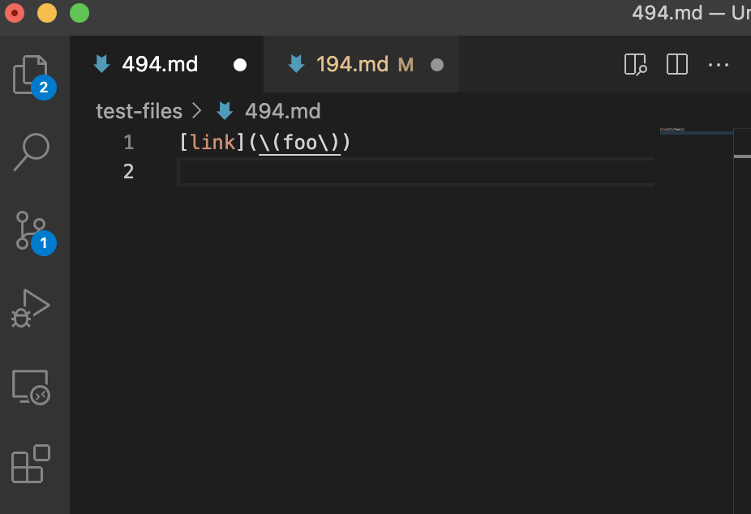

# Lab Report 5
---
### How I found the tests with different results:
I first used ```diff``` with this specific command ```diff markdown-parse/out.txt MarkdownParse/results.txt```. Running this command in the linux terminal gave me many differences between my ```out.txt``` file for my group's ```MarkdownParse.java``` code and the ```results.txt``` file for the results of the other ```markdown-parse``` repository we were given. From this, I was able to find that ```test-files/494.md``` and ```test-files/194.md``` were examples of differences between the two resulting files. After finding these files, I ```cat``` into each of the them using ```cat test-files/494.md``` and ```cat test-files/194.md``` to look at what content each file had. Then I opened up the testfiles from the commonmark-spec by cloning the repository we were given and using the preview to view the files and see how the link output was suppose to look. After using ```diff```, I manually went through the files that had different outputs to find which files has incorrect outputs from what was expected by preview. 

---

### Test 1: File 494
Both implementations gave the incorrect output for ```test-files/494.md```.
#### Image of Output of Both Implementations:


Our implementation gave the result ```[\(foo\]``` and the other implementation gave the output ```[\(foo\)]```. However, the actual output is suppose to be just ```[(foo)]```.

#### Image from Preview of Actual Output:


#### Describing the Bug:

The bug in the code is that our code just finds the first opening parentheses and the following closing parentheses. Our code does not check for multiple parentheses after the closing square bracket, therefore, our code recognizes the first open parentheses, but finds the first closing parentheses following this open parentheses instead of considering the othe r open parentheses following the initial one. As a result, the line ```\(foo\``` is returned because this is the section enclosed by the first open parentheses and first closing parentheses. ```test-files/494.md``` is linked below for reference. 

#### Image of Location of Bug in Code:
The two lines where ```openParen``` and ```closeParen``` are initialized is where the bug happens because the first open parentheses and following closing parentheses are found. I used print statements to print the indicies of ```openParen``` and ```closeParen```. These indicies aligned with the first open parentheses and following closed parentheses in ```test-files/494.md``` showing that the bug did occur in this location. 

The code that should be fixed would have to be in the location where the ```openParen``` and ```closeParen``` are being found because a stack would have to be used to push and pop parentheses to find exact link locations between the opening and closing parentheses. Additionally, another stack would also have to be added here to account for the escaped brackets in this ```.md``` file as well. 


---

### Test 2: File 194
Both implementations gave the incorrect output for ```test-files/194.md```.
#### Image of Output of Both Implementations:


Our implementation gave the result ```[]``` and the other implementation gave the output ```[url]```. However, the actual output is suppose to be ```[title (with parens)]```.


#### Image from Preview of Actual Output:


#### Describing the Bug:

The bug in the code is that our code checks for an opening parenthesess immediately following the closed bracket, however, because file ```194.md``` has a closing bracket immediately following the closed bracket, the code enters the if statement where we check for the opening parentheses and breaks because it passed the condition for the if staement since the text following the closed bracket is not an open parentheses. This causes ```[]``` or the initial ```toReturn``` empty arraylist to be returned. ```test-files/194.md``` is linked below for reference. 

#### Image of Location of Bug in Code:
The if statement where the ```break``` happens is in the image below. I added a print statement and printed the boolean of the condition within the if statment to ensure that this was the bug. The condition printed true when I printed the boolean value and the print line after break was not printed, so the bug happend here. 

The code that should be fixed would be the condition in the if statment below because instead of breaking after not finding a parentheses immediately after the closing bracket, the code should continue to check the other lines in the ```.md``` file. 


### File 494



### File 194

